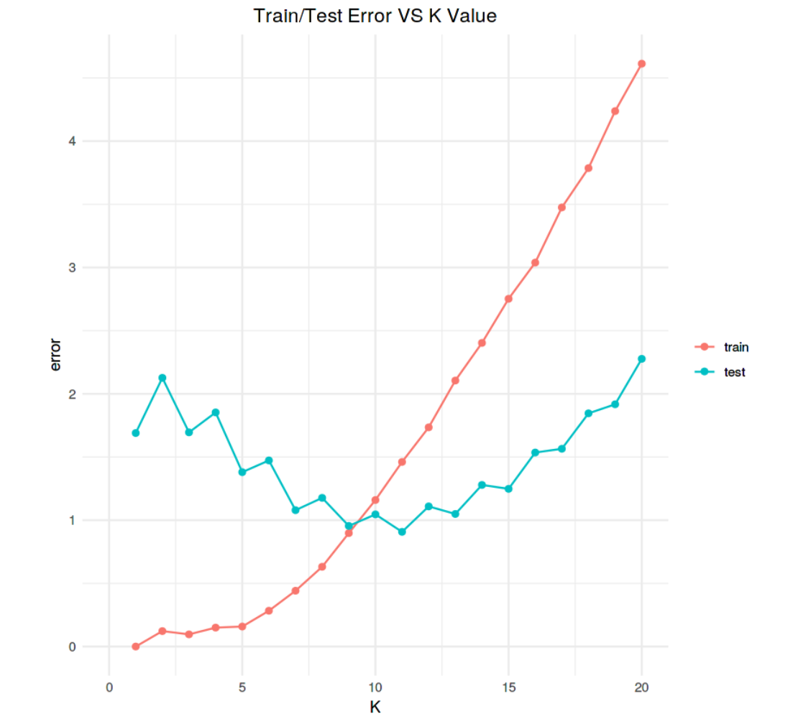
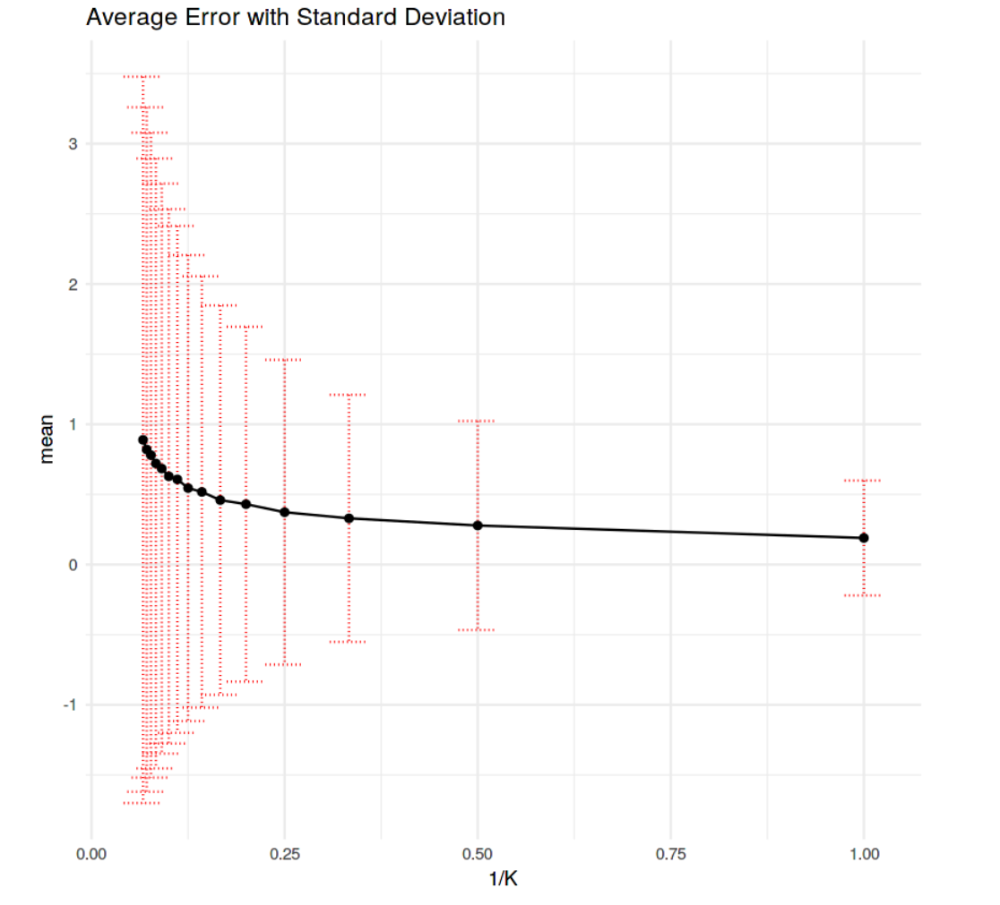
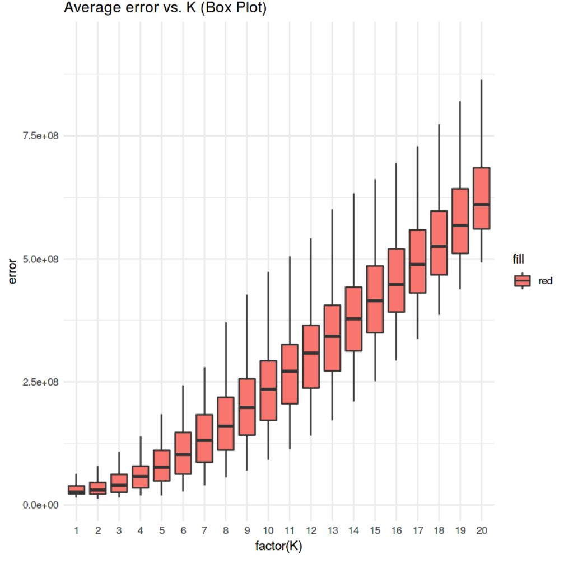
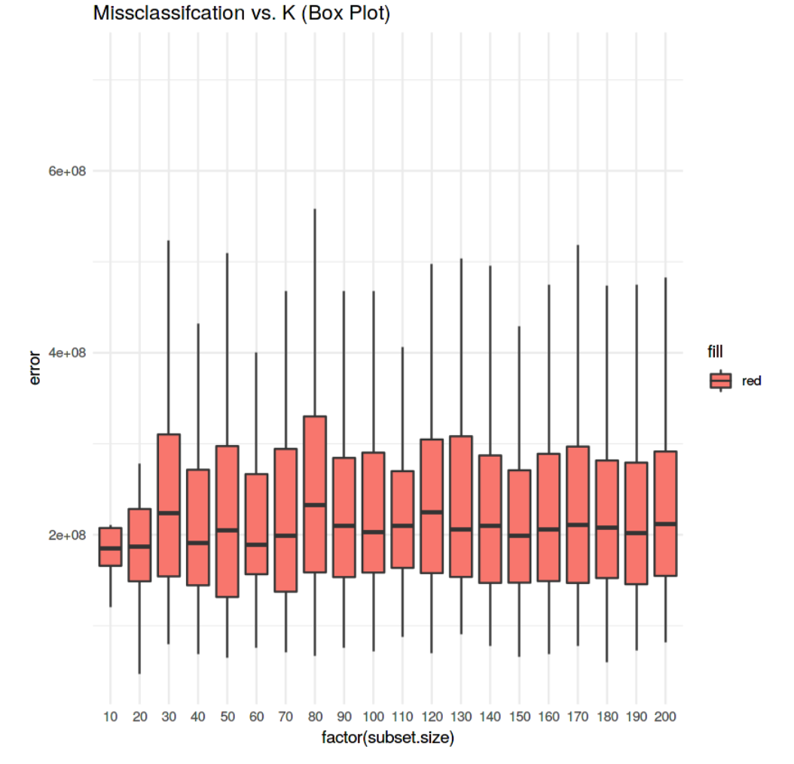
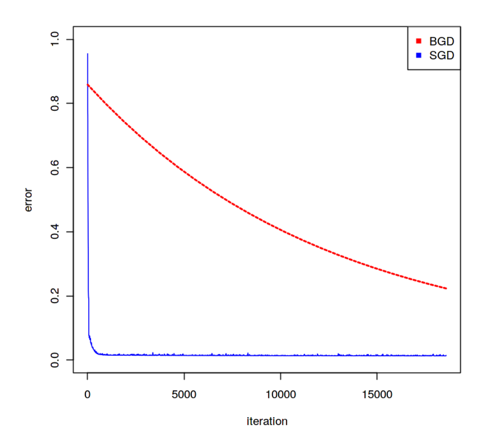
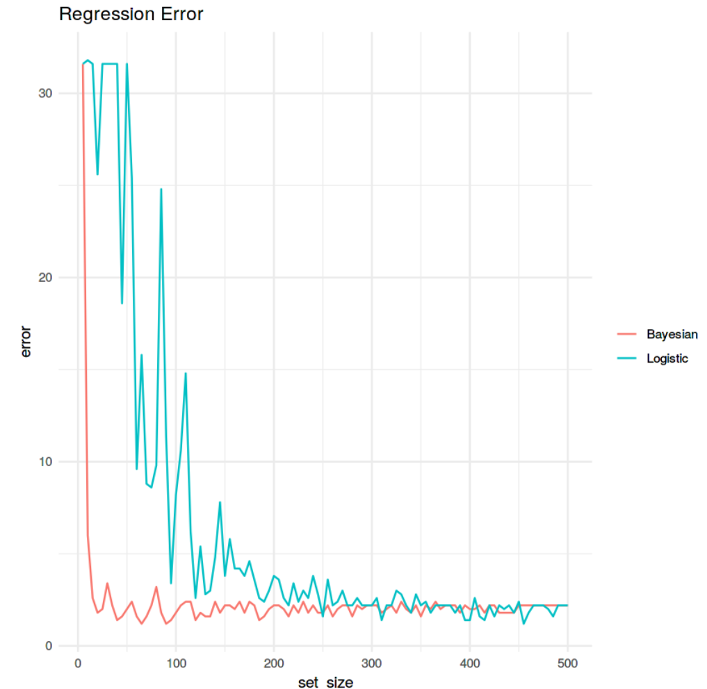

## Data Analysis and Algorithm on how to select the model complexity using Bootstrap , Subsets etc.

1. **1st Python notebook analyses on how to select the best K-value for a given Dataset.**

 

2. **Second python notebook explains about L-fold cross validation for the KNN regressor.**

 

3. **Third python notebook explains about the test error and its uncertainty with respect to K and DataSize VS Average error.**

 

 
 
4. **Fourth python notebook explains how SGD and BGD reacts to the given data set and how SGD converges quickly as compared to BGD.**

 

5. **Sixth python notebook contains a detailed analysis between the Logistic and Bayesian model and how the test increases as the size of the dataset is increased.**

 